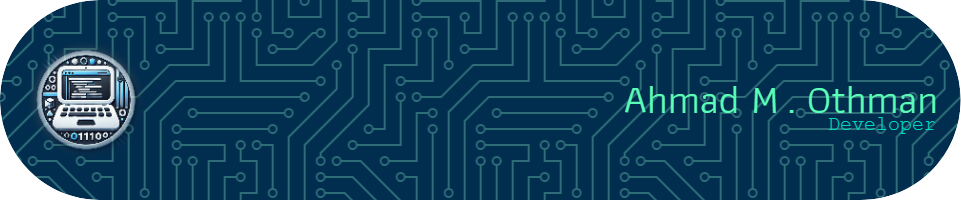

  <h1>👋 Hi, I'm Ahmad Munib</h1>
  
<strong>🚀 Passionate Fullstack Web Developer</strong>

  
Creating robust and scalable web applications, skilled in both front-end and back-end technologies, with a keen eye for user experience and performance optimization.

---

### 📫 Connect with Me

  
  
  
  

---

### 🔥 Rapid Fire
- 💼 **Current Work:** Working on government projects for customer support systems.
- 🌱 **Currently Learning:** AI, Automation, and OpenCV.

---

### 📊 GitHub Stats

  
    
  
    
  

---

### 🛠️ Skills

   
   
   
   
  
  
  
  
  
  

---

  <strong>💡 "Strive for progress, not perfection!"</strong>

